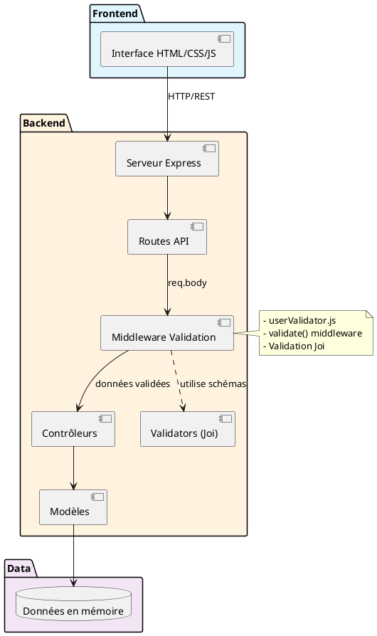
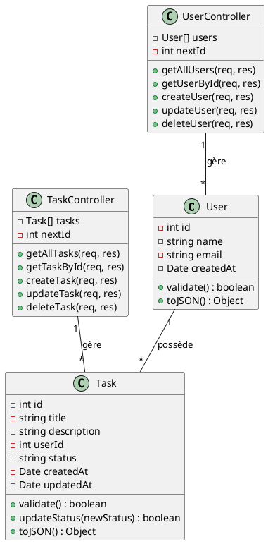
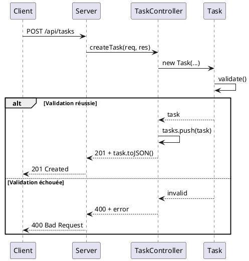
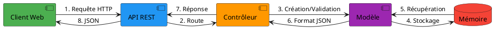
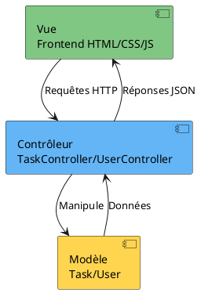

# Diagrammes UML du Projet - DoneProject

> 📊 Documentation complète des diagrammes UML illustrant l'architecture, les modèles, les flux de données et les séquences d'interactions de l'application.

## Vue d'ensemble

Ce document contient 5 diagrammes PlantUML mis à jour avec la couche de validation Joi et tous les endpoints CRUD.

### Fichiers source
- [architecture.puml](diagramme/architecture.puml)
- [classes.puml](diagramme/classes.puml)
- [sequence.puml](diagramme/sequence.puml)
- [mvc.puml](diagramme/mvc.puml)
- [flux-donnees.puml](diagramme/flux-donnees.puml)

---

## 1. Diagramme d'Architecture

**Fichier**: `diagramme/architecture.puml`

### Description
Vue globale de l'architecture 3-tiers avec la couche de validation Joi intégrée.

### Composants
- **Frontend**: Interface HTML/CSS/JS
- **Backend**: 
  - Serveur Express
  - Routes API
  - **Middleware Validation** (userValidator.js, validate())
  - Contrôleurs (UserController, TaskController)
  - Modèles (User, Task)
  - **Validators (Joi)** - Schémas de validation
- **Data**: Données en mémoire (futur MongoDB)

### Flux
```
Frontend → Serveur Express → Routes API 
→ Middleware Validation → Validators (Joi)
→ Contrôleurs → Modèles → Données en mémoire
```



---

## 2. Diagramme de Classes

**Fichier**: `diagramme/classes.puml`

### Description
Structure objet avec classes métier, contrôleurs et validateurs.

### Classes principales

#### User
- **Propriétés**: id, name, email, createdAt
- **Méthodes**: validate(), toJSON()

#### Task
- **Propriétés**: id, title, description, userId, status, createdAt, updatedAt
- **Méthodes**: validate(), updateStatus(), updateTaskStatus(), toJSON()

#### UserController
- **Propriétés**: users[], nextId
- **Méthodes**: getAllUsers(), getUserById(), createUser(), updateUser(), deleteUser()

#### TaskController
- **Propriétés**: tasks[], nextId
- **Méthodes**: getAllTasks(), getTaskById(), createTask(), updateTask(), deleteTask()

#### UserValidator (NEW)
- **Propriétés**: userSchema, userUpdateSchema
- **Validation**: name (2-100 chars), email (format valide)

#### Validator (NEW)
- **Méthodes**: validate(schema)
- **Rôle**: Middleware Express générique pour validation Joi

### Relations
- User (1) ↔ Task (*)
- UserController gère User
- TaskController gère Task
- UserController utilise UserValidator et Validator
- UserValidator valide User



## 3. Diagramme de Séquence - Création de Tâche



## 4. Flux de Données



## 5. Structure MVC


