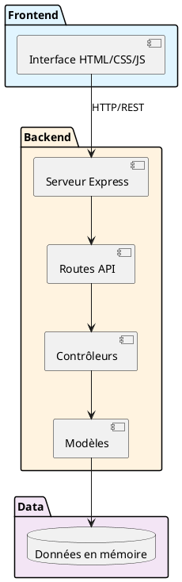
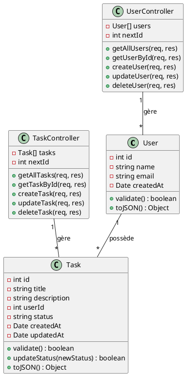
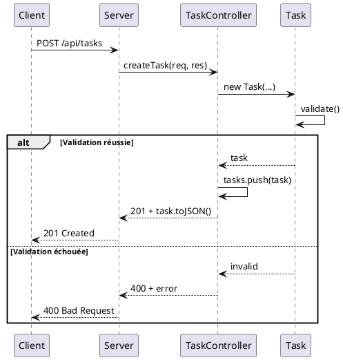
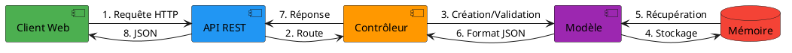
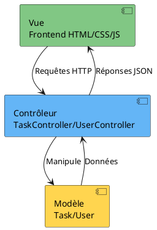

# Diagrammes du Projet

## 1. Diagramme d'Architecture

```plantuml
@startuml
package "Frontend" #e1f5ff {
    [Interface HTML/CSS/JS]
}

package "Backend" #fff3e0 {
    [Serveur Express]
    [Routes API]
    [Contrôleurs]
    [Modèles]
}

package "Data" #f3e5f5 {
    database "Données en mémoire"
}

[Interface HTML/CSS/JS] -down-> [Serveur Express] : HTTP/REST
[Serveur Express] -down-> [Routes API]
[Routes API] -down-> [Contrôleurs]
[Contrôleurs] -down-> [Modèles]
[Modèles] -down-> "Données en mémoire"
@enduml
```

## 2. Diagramme de Classes

```plantuml
@startuml
class User {
    -int id
    -string name
    -string email
    -Date createdAt
    +validate() : boolean
    +toJSON() : Object
}

class Task {
    -int id
    -string title
    -string description
    -int userId
    -string status
    -Date createdAt
    -Date updatedAt
    +validate() : boolean
    +updateStatus(newStatus) : boolean
    +toJSON() : Object
}

class UserController {
    -User[] users
    -int nextId
    +getAllUsers(req, res)
    +getUserById(req, res)
    +createUser(req, res)
    +updateUser(req, res)
    +deleteUser(req, res)
}

class TaskController {
    -Task[] tasks
    -int nextId
    +getAllTasks(req, res)
    +getTaskById(req, res)
    +createTask(req, res)
    +updateTask(req, res)
    +deleteTask(req, res)
}

User "1" -- "*" Task : possède
UserController "1" -- "*" User : gère
TaskController "1" -- "*" Task : gère
@enduml
```

## 3. Diagramme de Séquence - Création de Tâche

```plantuml
@startuml
participant Client
participant Server
participant TaskController
participant Task

Client -> Server: POST /api/tasks
Server -> TaskController: createTask(req, res)
TaskController -> Task: new Task(...)
Task -> Task: validate()
alt Validation réussie
    Task --> TaskController: task
    TaskController -> TaskController: tasks.push(task)
    TaskController --> Server: 201 + task.toJSON()
    Server --> Client: 201 Created
else Validation échouée
    Task --> TaskController: invalid
    TaskController --> Server: 400 + error
    Server --> Client: 400 Bad Request
end
@enduml
```

## 4. Flux de Données

```plantuml
@startuml
!define GREEN #4CAF50
!define BLUE #2196F3
!define ORANGE #FF9800
!define PURPLE #9C27B0
!define RED #F44336

component "Client Web" as A GREEN
component "API REST" as B BLUE
component "Contrôleur" as C ORANGE
component "Modèle" as D PURPLE
database "Mémoire" as E RED

A -right-> B : 1. Requête HTTP
B -right-> C : 2. Route
C -right-> D : 3. Création/Validation
D -right-> E : 4. Stockage
E -left-> D : 5. Récupération
D -left-> C : 6. Format JSON
C -left-> B : 7. Réponse
B -left-> A : 8. JSON
@enduml
```

## 5. Structure MVC

```plantuml
@startuml
component "Vue\nFrontend HTML/CSS/JS" as Vue #81C784
component "Contrôleur\nTaskController/UserController" as Controleur #64B5F6
component "Modèle\nTask/User" as Modele #FFD54F

Vue -down-> Controleur : Requêtes HTTP
Controleur -down-> Modele : Manipule
Modele -up-> Controleur : Données
Controleur -up-> Vue : Réponses JSON
@enduml
```
