```plantuml
@startuml
package "Frontend" #e1f5ff {
    [Interface HTML/CSS/JS]
}

package "Backend" #fff3e0 {
    [Serveur Express]
    [Routes API]
    [Middleware Validation]
    [Contrôleurs]
    [Modèles]
    [Validators (Joi)]
}

package "Data" #f3e5f5 {
    database "Données en mémoire"
}

note right of [Middleware Validation]
  - userValidator.js
  - validate() middleware
  - Validation Joi
end note

[Interface HTML/CSS/JS] -down-> [Serveur Express] : HTTP/REST
[Serveur Express] -down-> [Routes API]
[Routes API] -down-> [Middleware Validation] : req.body
[Middleware Validation] ..> [Validators (Joi)] : utilise schémas
[Middleware Validation] -down-> [Contrôleurs] : données validées
[Contrôleurs] -down-> [Modèles]
[Modèles] -down-> "Données en mémoire"
@enduml
```

# Diagrammes UML du Projet - DoneProject

> 📊 Documentation complète des diagrammes UML illustrant l'architecture, les modèles, les flux de données et les séquences d'interactions de l'application.

## Vue d'ensemble

Ce document contient 5 diagrammes PlantUML mis à jour avec la couche de validation Joi et tous les endpoints CRUD.

### Fichiers source
- [architecture.puml](diagramme/architecture.puml)
- [classes.puml](diagramme/classes.puml)
- [sequence.puml](diagramme/sequence.puml)
- [mvc.puml](diagramme/mvc.puml)
- [flux-donnees.puml](diagramme/flux-donnees.puml)

---

## 1. Diagramme d'Architecture

**Fichier**: `diagramme/architecture.puml`

### Description
Vue globale de l'architecture 3-tiers avec la couche de validation Joi intégrée.

### Composants
- **Frontend**: Interface HTML/CSS/JS
- **Backend**: 
  - Serveur Express
  - Routes API
  - **Middleware Validation** (userValidator.js, validate())
  - Contrôleurs (UserController, TaskController)
  - Modèles (User, Task)
  - **Validators (Joi)** - Schémas de validation
- **Data**: Données en mémoire (futur MongoDB)

### Flux
```
Frontend → Serveur Express → Routes API 
→ Middleware Validation → Validators (Joi)
→ Contrôleurs → Modèles → Données en mémoire
```



---

## 2. Diagramme de Classes

**Fichier**: `diagramme/classes.puml`

### Description
Structure objet avec classes métier, contrôleurs et validateurs.

### Classes principales

#### User
- **Propriétés**: id, name, email, createdAt
- **Méthodes**: validate(), toJSON()

#### Task
- **Propriétés**: id, title, description, userId, status, createdAt, updatedAt
- **Méthodes**: validate(), updateStatus(), updateTaskStatus(), toJSON()

#### UserController
- **Propriétés**: users[], nextId
- **Méthodes**: getAllUsers(), getUserById(), createUser(), updateUser(), deleteUser()

#### TaskController
- **Propriétés**: tasks[], nextId
- **Méthodes**: getAllTasks(), getTaskById(), createTask(), updateTask(), deleteTask()

#### UserValidator (NEW)
- **Propriétés**: userSchema, userUpdateSchema
- **Validation**: name (2-100 chars), email (format valide)

#### Validator (NEW)
- **Méthodes**: validate(schema)
- **Rôle**: Middleware Express générique pour validation Joi

### Relations
- User (1) ↔ Task (*)
- UserController gère User
- TaskController gère Task
- UserController utilise UserValidator et Validator
- UserValidator valide User

```plantuml
@startuml
class User {
    -int id
    -string name
    -string email
    -Date createdAt
    +validate() : boolean
    +toJSON() : Object
}

class Task {
    -int id
    -string title
    -string description
    -int userId
    -string status
    -Date createdAt
    -Date updatedAt
    +validate() : boolean
    +updateStatus(newStatus) : boolean
    +toJSON() : Object
}

class UserController {
    -User[] users
    -int nextId
    +getAllUsers(req, res)
    +getUserById(req, res)
    +createUser(req, res)
    +updateUser(req, res)
    +deleteUser(req, res)
}

class TaskController {
    -Task[] tasks
    -int nextId
    +getAllTasks(req, res)
    +getTaskById(req, res)
    +createTask(req, res)
    +updateTask(req, res)
    +deleteTask(req, res)
}

User "1" -- "*" Task : possède
UserController "1" -- "*" User : gère
TaskController "1" -- "*" Task : gère
@enduml
```



## 3. Diagramme de Séquence - Création de Tâche


## 4. Flux de Données

```plantuml
@startuml
!define GREEN #4CAF50
!define BLUE #2196F3
!define ORANGE #FF9800
!define PURPLE #9C27B0
!define RED #F44336

component "Client Web" as A GREEN
component "API REST" as B BLUE
component "Contrôleur" as C ORANGE
component "Modèle" as D PURPLE
database "Mémoire" as E RED

A -right-> B : 1. Requête HTTP
B -right-> C : 2. Route
C -right-> D : 3. Création/Validation
D -right-> E : 4. Stockage
E -left-> D : 5. Récupération
D -left-> C : 6. Format JSON
C -left-> B : 7. Réponse
B -left-> A : 8. JSON
@enduml
```



## 5. Structure MVC

```plantuml
@startuml
component "Vue\nFrontend HTML/CSS/JS" as Vue #81C784
component "Contrôleur\nTaskController/UserController" as Controleur #64B5F6
component "Modèle\nTask/User" as Modele #FFD54F

Vue -down-> Controleur : Requêtes HTTP
Controleur -down-> Modele : Manipule
Modele -up-> Controleur : Données
Controleur -up-> Vue : Réponses JSON
@enduml
```


